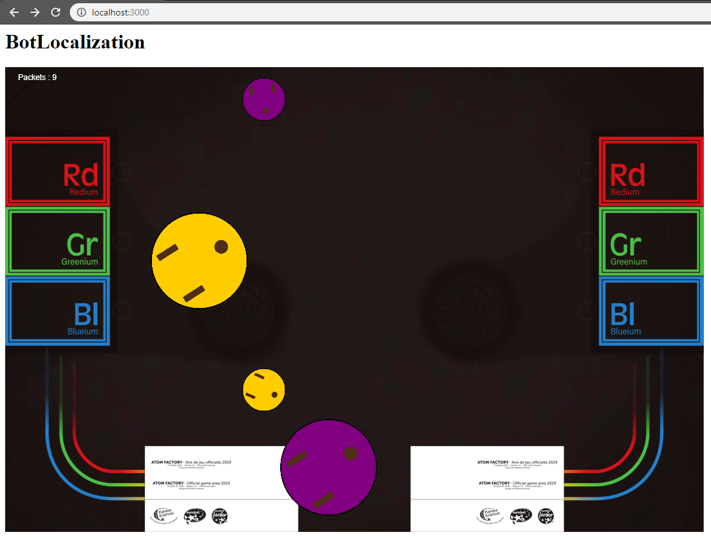

# ADSA - BotLocalization

## OBJECTIVE

Beeing able to send the two robots their position and the position of their ennemies in real time using cameras and wifi connections.

## ROADMAP

- [X] 1) Compile all the dependancies nedded for ARMv7 (OpenCV, Node.js, ...)
- [X] 2) Use a simple preset to benchmark the diffrent plafomrs (number of frame per seconds)
- [X] 3) Experiment with video feeds and calibrate the camera (distortion matrix)
- [X] 4) Learn to recognize and calculate 3D position of printed QRcodes with OpenCV and ArcUco
- [X] 5) Implement vizualtisation interface to see the marker's position in real time in a 2D space (p5.js ?)
- [ ] 6) Implement the physical solution on a reproduction of the official competition's Arena
- [ ] 7) Beeing able to track all the robots at the same time

### Future
- [ ] 8) Add all the robots, the key points and the arena on the 2D interface
- [ ] 9) Setup the live comunication with the robots
- [ ] 10) Implement initialization in a new arena, with key points

## Work done :

1) The openCV library is compiled and usable on the Raspery Pi
2) Benchmark is fonctionnal and the results are available here [*Benchmarks*](https://github.com/WeberJulian/BotLocalization/blob/master/benchmark/benchmarks.md)
3) I already manage to handle the video feed and I am working on the calibration of the camera
4) Calibration done, I've just finished eulidian distance evaluation from video feed
5) Working 2D visualization

